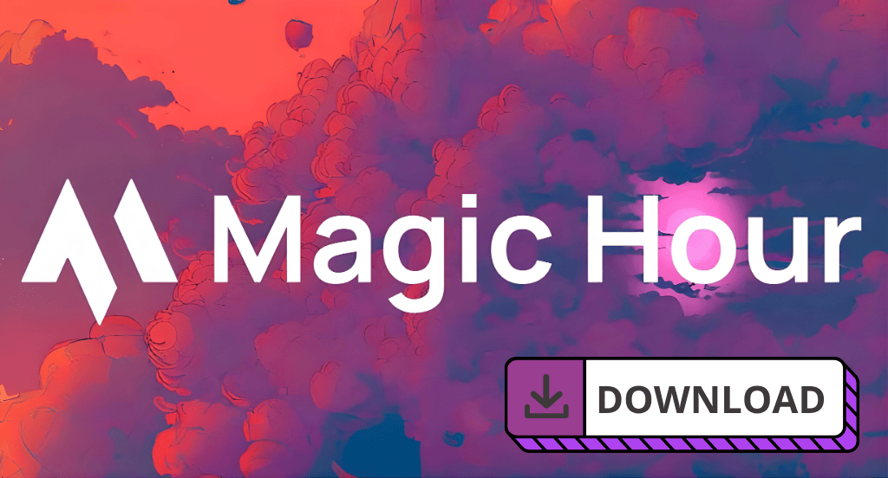

# 🪄 MagicHour AI Desktop

  

## 💡Why Do You Need the Desktop App?

Stop wasting hours rendering in the browser, putting up with cloud compression, and struggling with a clunky interface. **Magic Hour AI Desktop** is the ultimate AI studio for content generation and editing, brought straight to your PC. We took your favorite browser features and supercharged them with professional desktop tools.

Forget compromises: get pixel-perfect control over every frame, speed up your SMM routine tenfold, and save money. Your content. Your PC. Your rules. The perfect tool for creators, marketers, and video makers—right here, right now.

> 🎁 **Exclusive Bonus:** Download the desktop version right now and get **14 days of the premium Business plan absolutely free**! No hidden terms—just install the app and unlock the full potential of neural networks.

---

## 💎 Main Advantage: Hybrid Compute (Save Credits)

The desktop version can leverage your PC's hardware resources (GPU and CPU) to assist our cloud servers.
**What does this mean for you?** You spend *significantly fewer platform credits*, as part of the processing (like face tracking, masking, and upscaling) happens locally. Moreover, thanks to direct rendering on your machine, the final generation quality is higher than on the web, as unnecessary file transfer compression is eliminated. Lower costs—better results.

---

## 🛠️ Desktop Killer Features

| Tool | How it works | Your Profit |
| --- | --- | --- |
| **Multi-Style Grid** | Run a single source file through 4 different presets simultaneously on one screen. | Instant selection of the best style. Protects you from wasting credits. |
| **Precision Masking** | A manual tool for precise object selection with a mouse (Rotoscoping). | Total control over the frame. Turns the software into a tool for pros. |
| **Face Swap Pro-Map** | Manual adjustment of face alignment, lighting, and color correction. | Eliminates the "pasted face" effect. Maximum realism. |
| **Social Media Batcher** | Auto-cropping a video into 9:16, 16:9, and 1:1 formats with UI "safe zones" overlays. | Massive time saver. One click—and your content is ready for all platforms. |
| **Local Media Bridge** | Direct drag-and-drop import of media from your local drive. | Work with heavy source files without long uploads to the cloud. |
| **Iteration Timeline** | A visual generation history with the ability to quickly roll back to older versions. | Freedom to experiment. You will never lose a successful setting or seed. |
| **Background Upscale** | Background enhancement of finished videos to 4K using your PC's GPU. | Work without lag or waiting times, getting maximum quality output. |

---

## 🚀 Installation

Installation takes just a couple of minutes.

1. Go to the [**Releases**](../../releases).
2. Download the installer for your system:
* **Windows:** Download `MagicHour_x64.exe` and follow the installer instructions.
* **macOS:** Download `MagicHour_macOS.dmg`, open the image, and drag the app icon into your `Applications` folder.

3. Log in to your account (the 14-day Business subscription will activate automatically).

---

## 💻 System Requirements

We’ve optimized the engine so that the core features fly even on mid-range machines. However, to unlock the full potential of **Hybrid Compute**, you will need a powerful graphics card.

| Component | Minimum Requirements (Web rendering + UI) | Recommended Requirements (Hybrid Compute & 4K Upscale) |
| --- | --- | --- |
| **OS** | Windows 10/11 (64-bit) / macOS 12+ | Windows 11 / macOS 13+ |
| **Processor** | Intel Core i5 / AMD Ryzen 5 / Apple M1 | Intel Core i7 / AMD Ryzen 7 / Apple M2 Pro, M3 Max |
| **RAM** | 8 GB RAM | 16 GB - 32 GB RAM |
| **Graphics Card** | Integrated graphics or any discrete GPU (4GB+ VRAM) | NVIDIA RTX 3060 or higher (8GB+ VRAM) / Apple Silicon Neural Engine |
| **Disk Space** | 2 GB for installation (SSD recommended) | 10 GB SSD (for local AI model caching) |

---

## 🤝 Meet the Team

We are a small team of geeks who combined our experience in film production and machine learning to make AI editing accessible to everyone:

* **Alex V.** (AI Engineer) — ensures models don't "melt" your PC during local rendering; the architect behind Hybrid Compute.
* **Maria S.** (Product Designer) — translated the complex functionality of node-based editors into an interface that even a beginner can understand.
* **Denis K.** (VFX Expert) — 10 years in post-production. He is the reason "Precision Masking" works like professional rotoscoping, not just a cheap filter.

---

## ❓ FAQ: Answers to the Main Questions

**1. How do I activate the free 14 days of the Business plan?**
You don't need to enter promo codes or link a credit card. Just download the app, log into your account (or create a new one), and the Business plan will be applied to your account automatically for the next two weeks.

**2. Will the app work if I have a weak PC or an old Mac?**
Yes! In this case, the app will work in the classic cloud mode (like the browser version), offloading all tasks to our servers. You will still enjoy the convenient interface and all the killer features (Timeline, Social Media Batcher), but without the local credit savings.

**3. How exactly does Hybrid Compute save my credits?**
When this mode is enabled, your hardware takes on the "heaviest" math: object tracking, upscaling, color correction, and rotoscoping. Our servers handle only the pure AI generation. Since our server power costs drop, we charge you up to 60% fewer credits per operation.

**4. Are my source files uploaded to your servers when using the Local Media Bridge?**
We care about your privacy. When using the "Local Media Bridge," only the metadata and compressed frame fragments strictly needed by the neural network for generation are sent to the cloud. The actual 10-gigabyte ProRes source file stays safely on your hard drive.

**5. Can I export masks and results to Premiere Pro or After Effects?**
Absolutely. The Desktop version allows you to export generated results or manually created masks with an alpha channel (transparency) for seamless integration into your usual workflow (`.mov` formats with ProRes 4444).

**6. Are projects synced between the browser and the Desktop version?**
Yes, your project library is fully synchronized. You can start a draft on your phone in the browser while commuting, and finish the detailed rendering and upscaling at home on your PC.

## 📄 License

This project is licensed under the Apache License, Version 2.0 (the [LICENSE](../../LICENSE));
